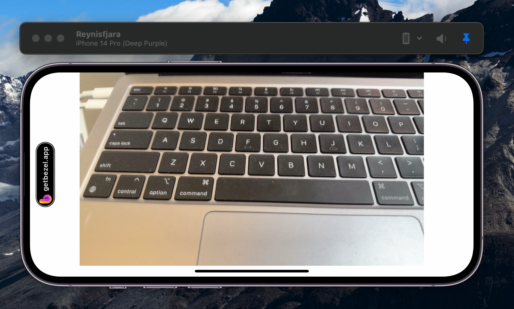

# Color invert filter 

This is a simplified version of our custom camera with a simple preview that only supports landscape left. The goal is to update `SampleBufferTransformer` to invert the colors.

**Original**

**Goal**

## Requirements 

- Implementation with Swift
- Create a repo with code provided 
  - Create a PR with the changes you made
  - Briefly explain your approach and possible improvements if you had more time
- Can ignore all error handling by using `fatalError()`
- Feel free to ask any questions or tips if there's something unclear